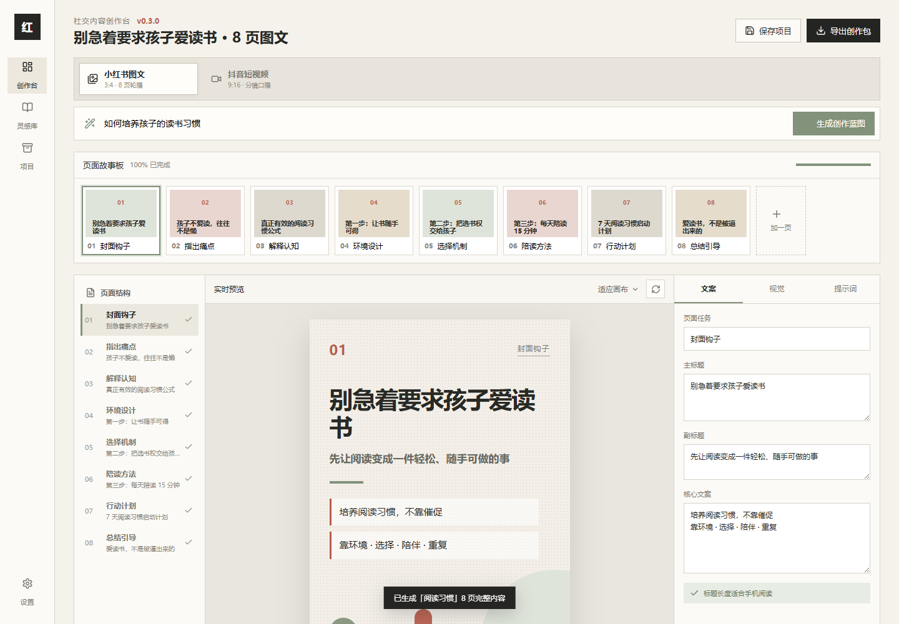
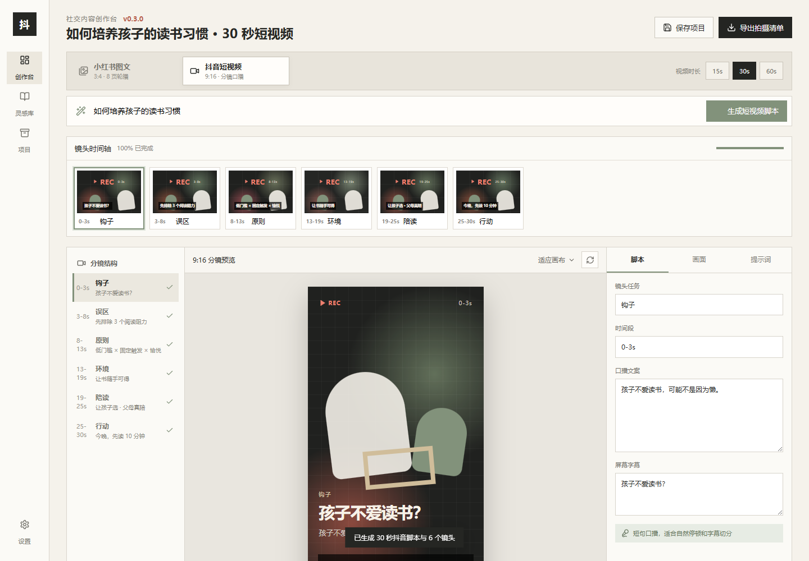

# 社交内容创作台 / XHS Visual Studio

> An open-source creation studio for Chinese social content. It turns a topic into Xiaohongshu carousel pages or Douyin short-video storyboards with editable copy, visual direction, and exportable prompts.

[Online demo](https://zeze20231224.github.io/xhs-visual-studio/?v=0.3.0) · [Demo Guide](#demo-guide) · [Features](#features) · [Roadmap](#roadmap) · [中文说明](#中文说明)

## Why This Project Exists

Many individual creators, parents, educators, and small businesses want to publish structured social content, but the actual workflow is scattered across chat windows, notes, image prompts, design tools, and video scripts.

This project explores a more practical workflow:

- Start from one topic.
- Generate a clear content structure.
- Preview each page or scene visually.
- Edit the copy, visual direction, and AI generation prompts in one place.
- Export a usable creation package for image generation, design work, or short-video production.

The current version is a frontend MVP. It does not yet call the OpenAI API directly, but it is designed to become an AI-assisted open-source content creation tool.

## Demo Guide

Open the live demo:

[https://zeze20231224.github.io/xhs-visual-studio/?v=0.3.0](https://zeze20231224.github.io/xhs-visual-studio/?v=0.3.0)

Try these flows:

1. Select **Xiaohongshu Carousel**.
2. Enter a topic such as `如何培养孩子的读书习惯`.
3. Click **Generate Creation Blueprint**.
4. Review and edit the 8-page carousel copy, visual direction, and prompts.
5. Export the Markdown creation package.

For short video:

1. Select **Douyin Short Video**.
2. Choose 15s, 30s, or 60s.
3. Enter the same topic.
4. Generate the video script and review each scene's voiceover, subtitle, shot, and prompt.
5. Export the shooting checklist.

The app currently stores project data in the browser, so no login is required for the demo.

## Install to Desktop or Mobile

The app can be saved like a lightweight web tool from most modern browsers:

- **Desktop Chrome or Edge:** open the demo URL, then use the browser menu and choose **Install app** or **More tools > Create shortcut**.
- **Android Chrome:** open the demo URL, tap the browser menu, then choose **Add to Home screen**.
- **iPhone Safari:** open the demo URL, tap **Share**, then choose **Add to Home Screen**.

See the full guide: [docs/INSTALL.md](docs/INSTALL.md).

## Screenshots

### Xiaohongshu Carousel Mode



### Douyin Short Video Mode



## Features

### Xiaohongshu Carousel

- Generate an 8-page carousel blueprint from a topic.
- Edit page title, subtitle, core copy, and image-generation prompt.
- Preview a 3:4 mobile-friendly visual card for each page.
- Use structured templates for parenting, reading-habit, and general creator topics.
- Export a Markdown creation package with all page copy and prompts.
- Save project data locally in the browser.

### Douyin Short Video

- Generate 15s, 30s, or 60s short-video scripts.
- Split the idea into timed scenes, voiceover, subtitles, visual shots, and camera movement.
- Preview each scene in a 9:16 storyboard layout.
- Edit scene-level video prompts.
- Export a Markdown shooting checklist.

## Open Source Maintenance Use Case

This repository is maintained as an open-source experiment in AI-assisted creator tooling. Codex is useful for:

- React frontend development and refactoring.
- UI debugging across desktop and mobile layouts.
- Improving prompt workflows for visual and video generation.
- Adding export formats and automation.
- Maintaining documentation, issues, releases, and GitHub Pages deployment.

API credits would be used to prototype optional AI-powered features such as topic-to-carousel generation, Douyin storyboard generation, prompt quality checks, and template recommendations.

## Roadmap

- [ ] Add OpenAI API integration for dynamic topic-to-carousel generation.
- [ ] Add AI-assisted Douyin script generation with configurable tone and audience.
- [ ] Add a prompt template library for different content niches.
- [ ] Add one-click image prompt export for GPT Image and other image models.
- [ ] Add PWA installation support for desktop and mobile.
- [ ] Add project import/export in JSON format.
- [ ] Add automated content quality checks for title clarity, hook strength, and page flow.
- [ ] Add bilingual documentation for contributors.

## Local Development

```powershell
npm.cmd install
npm.cmd run dev
```

Open the local Vite URL shown in the terminal.

Production build:

```powershell
npm.cmd run build
```

## Project Structure

```text
src/
  main.jsx        Main React application and creation workflows
  styles.css      Visual system and responsive layout
public/
  assets/pages/   Legacy sample page assets
docs/
  screenshots/    README screenshots
```

## 中文说明

社交内容创作台是一个面向普通创作者的小红书图文与抖音短视频创作工具。输入一个主题后，它会生成：

- 小红书 8 页图文结构、逐页文案、视觉方向和图片提示词。
- 抖音 15/30/60 秒短视频脚本、分镜、口播、字幕和视频提示词。

它适合：

- 需要稳定更新小红书图文的个人创作者。
- 想把育儿、教育、生活方式等主题做成结构化内容的人。
- 想把 AI 生图/视频提示词变成可复用工作流的设计师和运营人员。
- 需要先完成内容蓝图，再交给设计或图像模型执行的小团队。

当前版本最实际的价值是：把散落在聊天、文档和提示词里的图文与短视频策划过程，集中到一个可编辑、可预览、可导出的工作台中。

## References

Prompt-design methodology reference:

- [YouMind-OpenLab/awesome-gpt-image-2](https://github.com/YouMind-OpenLab/awesome-gpt-image-2)

When reusing content from that repository, follow its license and attribution requirements.

## License

This project is released under the [AGPL-3.0](LICENSE) license.
